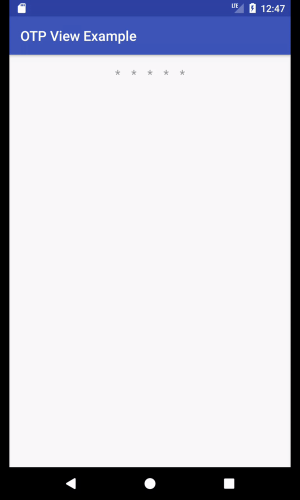

[](https://jitpack.io/#msayan/otp-view)

# OTP View

Ready to use one time password component.



## Usage

### XML

```xml

<com.hololo.library.otpview.OTPView
        android:layout_width="match_parent"
        android:layout_height="wrap_content"
        android:gravity="center"
        app:hintColor="@android:color/holo_blue_bright"
        app:inputType="number"
        app:otpText="123"
        app:count="7"
        app:textColor="@color/colorPrimary"
        app:otpHint="*" />

```

### Java
```java
        OTPView otpView = (OTPView) findViewById(R.id.otpView);
        otpView.setTextColor(R.color.colorAccent)
                .setHintColor(R.color.colorAccent)
                .setCount(7)
                .setInputType(InputType.TYPE_CLASS_NUMBER)
                .setViewsPadding(16)
                .setListener(new OTPListener() {
                    @Override
                    public void otpFinished(String otp) {
                        Toast.makeText(MainActivity.this, "OTP finished, the otp is " + otp, Toast.LENGTH_SHORT).show();
                    }
                })
                .fillLayout(); 
```

### OTP Listener
```java
    otpView.setListener(new OTPListener() {
                   @Override
                   public void otpFinished(String otp) {
                       Toast.makeText(MainActivity.this, "OTP finished, the otp is " + otp, Toast.LENGTH_SHORT).show();
                   }
               });
```

## Download

### Step 1. Add the JitPack repository to your build file

Add it in your root build.gradle at the end of repositories:

```groovy

	allprojects {
		repositories {
			...
			maven { url 'https://jitpack.io' }
		}
	}
```

### Step 2. Add the dependency

```groovy

	dependencies {
		compile 'com.github.msayan:otp-view:v1.0.2'
	}
  
```

## License

    MIT License
    
    Copyright (c) 2017 Mehmet Ayan
    
    Permission is hereby granted, free of charge, to any person obtaining a copy
    of this software and associated documentation files (the "Software"), to deal
    in the Software without restriction, including without limitation the rights
    to use, copy, modify, merge, publish, distribute, sublicense, and/or sell
    copies of the Software, and to permit persons to whom the Software is
    furnished to do so, subject to the following conditions:
    
    The above copyright notice and this permission notice shall be included in all
    copies or substantial portions of the Software.
    
    THE SOFTWARE IS PROVIDED "AS IS", WITHOUT WARRANTY OF ANY KIND, EXPRESS OR
    IMPLIED, INCLUDING BUT NOT LIMITED TO THE WARRANTIES OF MERCHANTABILITY,
    FITNESS FOR A PARTICULAR PURPOSE AND NONINFRINGEMENT. IN NO EVENT SHALL THE
    AUTHORS OR COPYRIGHT HOLDERS BE LIABLE FOR ANY CLAIM, DAMAGES OR OTHER
    LIABILITY, WHETHER IN AN ACTION OF CONTRACT, TORT OR OTHERWISE, ARISING FROM,
    OUT OF OR IN CONNECTION WITH THE SOFTWARE OR THE USE OR OTHER DEALINGS IN THE
    SOFTWARE.
